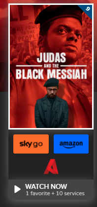

    <h1 align="center"><strong>Trakt.tv-Ask4Movie</strong></h1>
    <h3 align="center">Userscript to directly link to watch movies and shows directly from a Trakt page.</h3>
    

    <h2 align="left">How to install</h2>
    <ol align="left">
        <li>Download one of these add-ons for your browser:
            <ul>
                <li>Tampermonkey for <a
                        href="https://chrome.google.com/webstore/detail/tampermonkey/dhdgffkkebhmkfjojejmpbldmpobfkfo?hl=en">Chrome</a>,
                    <a href="https://addons.mozilla.org/en-GB/firefox/addon/tampermonkey/">Firefox</a> or <a
                        href="https://addons.opera.com/en-gb/extensions/details/tampermonkey-beta/">Opera</a>.</li>
            </ul>
        </li>
        <li><a href="https://github.com/wadforth/Trakt.tv-Ask4Movie/raw/main/Trakt%20link%20to%20Ask4Movie.user.js">Click Me</a></li>
        <li>Done!</li>
    </ol>
    

     <h3 align="center"><b>Disclaimer:</b> Disclaimer: I do not condone piracy, this script was created entirely for educational purposes. Use the official services provided by trakt when neccessary.</h3>

<h4>
Works with movies and shows. Linking directly to seasons will be added soon.</h4>

